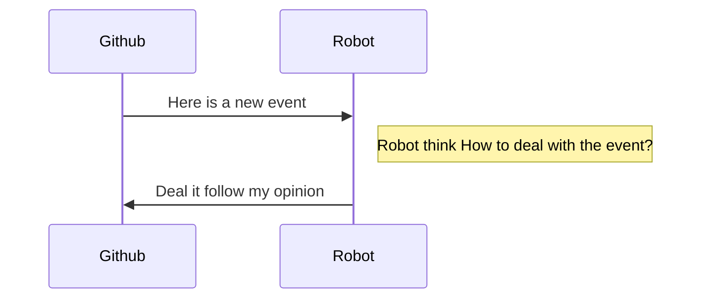
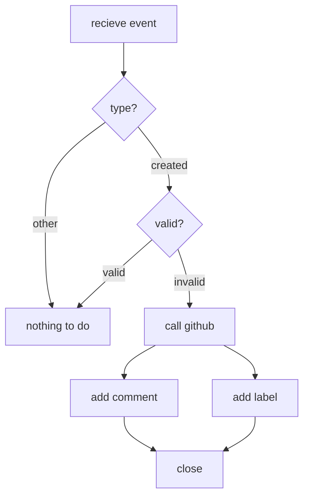

## 需求

在项目开源(公开)后，使用者会对项目提供意见、反馈、建议等。这些issue当中会存在「不合要求」的issue，并对项目开发产生干扰。

在这种情况下，假设出现了「不合格」的issue，如果要进行人工处理，将是比较庞大的工作，而我们并不期望这些琐事占用我们太多的时间。

## 目标 

使用&#x1f916;来判断issue是否「合格」。如果「不合格」，则直接关闭issue。

## 实现

基于以上，我们要构建这样的&#x1f916;，需要具备:

1. 项目本身要有`Webhook`可被调用
2. 机器人要有对项目的权限

### `Github `配置

1. 开通项目的`Webhook`，并设置`screct`和`payload`地址(回调)
2. 为机器人开通帐号，并获取身份标识`token`

### 基本时序

程序由`webhook`触发，因此本程序是一个服务端运行的程序。具体时序图：

### 流程

当接受到一次调用，程序处理逻辑：

## 实现

### 搭建框架

由于是纯接口操作，我们只需要构建一个服务端。本质上用任何一个可实现服务端的语言/框架都可以，选择我们较为熟悉的`js`语法，并通过`node`来构建web服务。为了减少底层工作，比如「文件操作」、「HTTP协议」处理，我们选择让`koa`框架来处理这些事，我们专注于自身业务逻辑。

### 模块划分

1. 主模块 `用来整合其他模块并处理网络请求`
2. `github`模块 `处理向github发送的各种命令`
3. 日志模块 `调试用，并记录请求`
4. 业务逻辑模块 `对接受到的消息进行判断和处理`

## 参考

1. https://github.com/ant-design/ant-bot
2. https://github.com/iview/iview-bot

